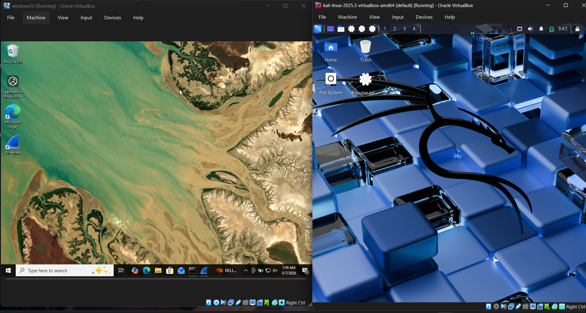
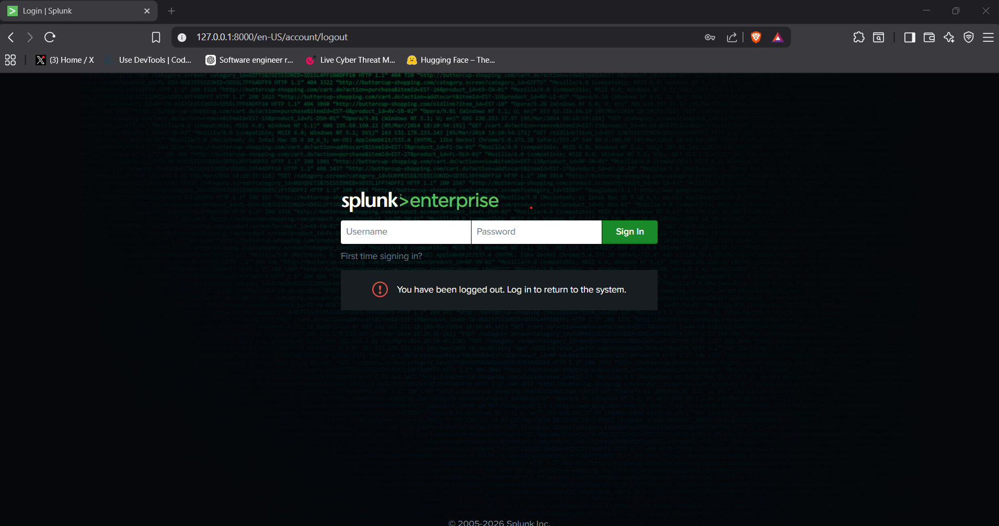
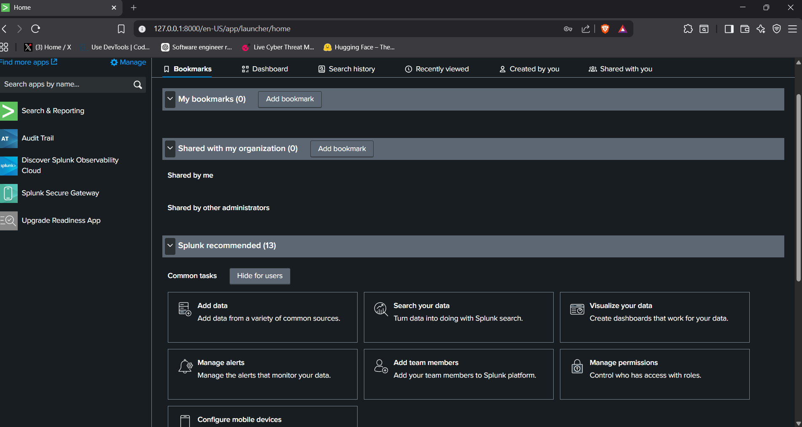
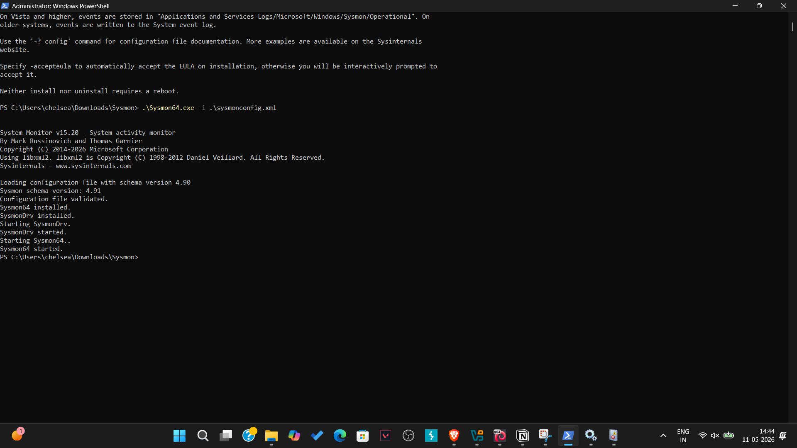
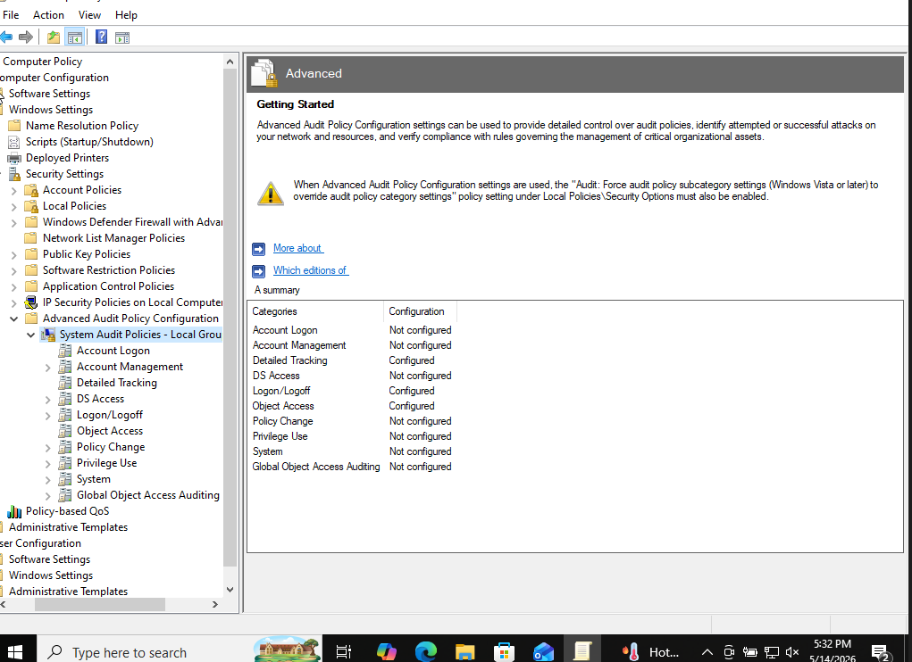
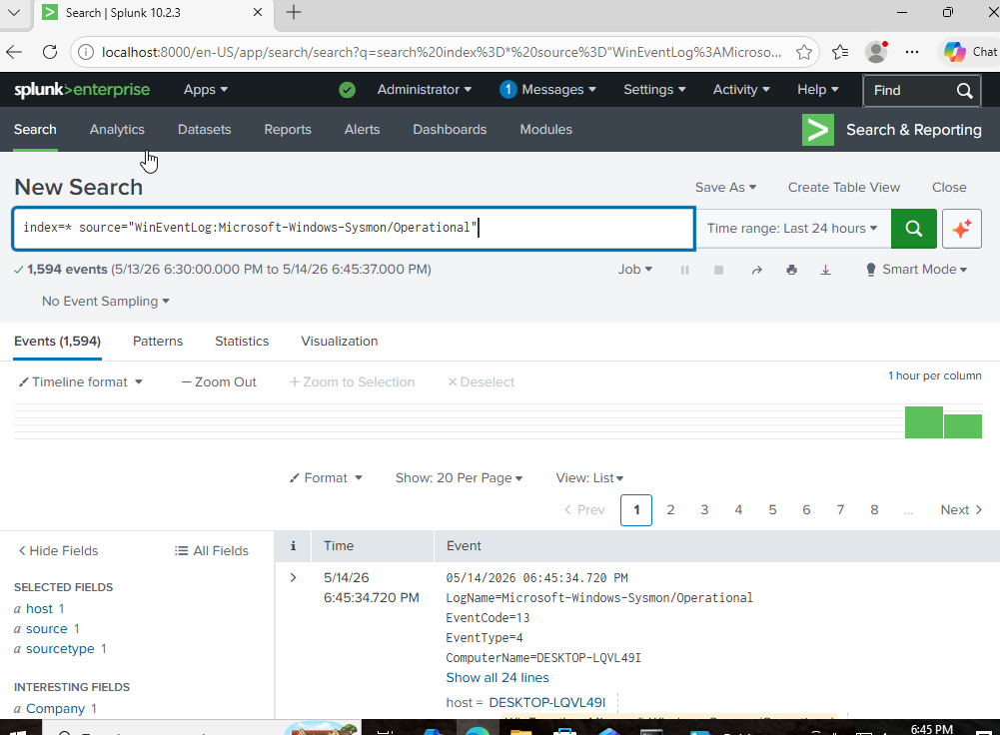
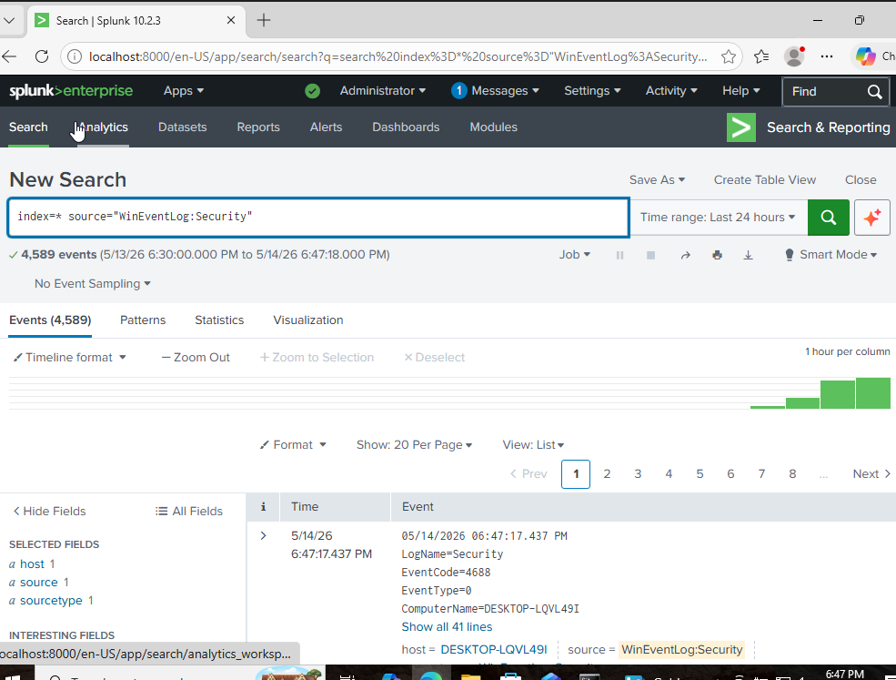

# Home SOC Lab

## Overview

This project demonstrates the implementation of a Home Security Operations Center (SOC) Lab using Windows, Kali Linux, Splunk Enterprise, and Sysmon.

The objective was to build a centralized log monitoring environment capable of collecting, analyzing, and investigating security events for threat detection and security monitoring.

---

## Lab Architecture

Windows VM → Sysmon → Splunk Universal Forwarder → Splunk Enterprise

Kali Linux was deployed as an attacker workstation for future attack simulation and testing.

---

## Technologies Used

* Splunk Enterprise
* Splunk Universal Forwarder
* Sysmon
* Windows 11
* Kali Linux
* VirtualBox

---

## Project Setup

### Step 1: Virtual Machines

* Windows VM
* Kali Linux VM

### Step 2: Splunk Enterprise Installation

Installed and configured Splunk Enterprise as the SIEM platform.

### Step 3: Sysmon Installation

Installed Sysmon to collect enhanced endpoint telemetry including:

* Process Creation
* Command Line Activity
* Device Events
* Security Monitoring Data

### Step 4: Windows Audit Policies

Configured Windows Advanced Audit Policies:

* Audit Logon
* Audit Process Creation
* Audit File System
* Audit Removable Storage

Key Event IDs:

* 4624 – Successful Logon
* 4625 – Failed Logon
* 4688 – Process Creation
* 4663 – File Access

### Step 5: Log Ingestion

Configured inputs.conf to ingest:

* Windows Security Logs
* Sysmon Operational Logs
* PowerShell Logs

---

## Results

Successfully ingested:

* Sysmon Logs into Splunk
* Windows Security Logs into Splunk

Verified visibility of endpoint telemetry and authentication events through Splunk Search & Reporting.

---

## Skills Demonstrated

* SIEM Administration
* Log Management
* Security Monitoring
* Windows Event Logging
* Sysmon Deployment
* Splunk Configuration
* Audit Policy Configuration
* Security Event Analysis

---

## Future Improvements

* Brute Force Detection Use Case
* PowerShell Attack Detection
* USB Monitoring Alerts
* Splunk Dashboards
* Threat Hunting Scenarios

## Log Sources Configured

The following Windows event channels were configured for ingestion into Splunk:

- WinEventLog:Security
- Microsoft-Windows-Sysmon/Operational
- Windows PowerShell Logs

These sources provided authentication, process creation, and endpoint telemetry data for security monitoring.
## Screenshots

### Windows and Kali Virtual Machines

### Splunk Enterprise Installation

### Splunk Dashboard

### Sysmon Installation

### Audit Policy Configuration

### Sysmon Log Ingestion

### Windows Security Log Ingestion

